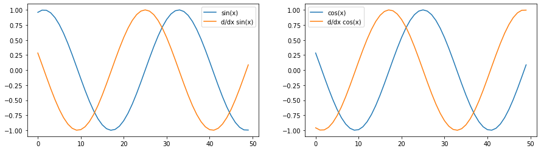

# Toydiff
Toydiff is a small toy-package to perform automatic differentiation on 
scalars. It is built using plain Python and NumPy to be able to handle NumPy
arrays.

The library consist of a set of operations that `keep track of the gradient`. 
The operations can compute in `forward` and `backward` modes.

## Installation
Normal user:
```bash
pip install toydiff/.
```

alternatively:
```bash
pip install toydiff/. -r toydiff/requirements-base.txt
```

Developer:
```bash
pip install -e toydiff/. -r toydiff/requirements-dev.txt
```

## Tests
To run test, you must install the library as a developer.
```bash
cd toydiff/
sh run_tests
```

alternatively:
```bash
cd toydiff/
pytest -v tests/
```

## Usage
You can build simple computational graphs using toydiff. Let's build the graph 
for the function *f (x, y, z) = (x + y)·z*. 
This example comes from [Stanford backprop lecture](http://cs231n.stanford.edu/slides/2017/cs231n_2017_lecture4.pdf)

We will call *q = (x + y)*. Assume that *x = -2, y = 5, z = -4*; then:
```python
from toydiff.ops import Add, Multiply

x = -2
y = 5
z = -4

# create graph
q = Add()
f = Multiply()

# run graph
q_val = q.forward(x, y)
f_val = f.forward(q_val, z)

# see gradients
df_dq, df_dz = f.backward(incoming_grad = 1) # df/df = 1
dq_dx, dq_dy = q.backward(incoming_grad=df_dq)
```

You can also work with NumPy arrays (most of the time):
```python
import numpy as np
from toydiff.ops import Sin, Cos
from matplotlib import pyplot as plt

x = np.arange(-5,5, 0.2)

sin = Sin()
cos = Cos()

fig, ax = plt.subplots(nrows=1, ncols=2, figsize=(15,4))
ax[0].plot(sin.forward(x), label="sin(x)")
ax[0].plot(sin.backward(incoming_grad=1), label="d/dx sin(x)")
ax[0].legend()

ax[1].plot(cos.forward(x), label="cos(x)")
ax[1].plot(cos.backward(incoming_grad=1), label="d/dx cos(x)")
ax[1].legend()
```

